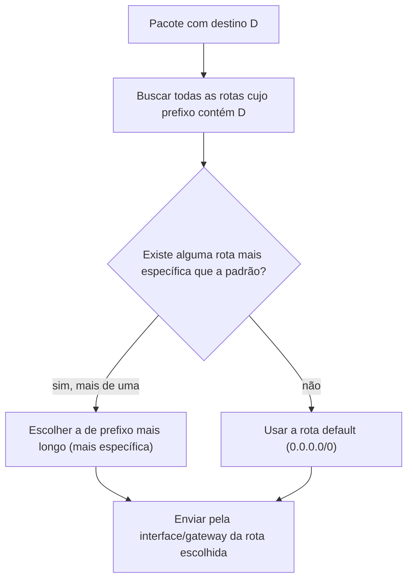

> **Para quem é:** quem já rodou `ip route show` sem entender por que uma rota específica ganha de outra, ou que precisa que um host com duas interfaces de rede mande tráfegos diferentes por saídas diferentes.

Todo pacote que um host Linux precisa enviar passa por uma decisão: por qual interface e por qual próximo salto (gateway) ele deve sair. Essa decisão não é um detalhe de baixo nível isolado; é o que sustenta desde o roteamento entre a rede de Pods e a rede do host, discutido na [comparação entre modelos de rede](../../fundamentals/osi-and-tcpip/), até por que dois nós em sub-redes diferentes conseguem (ou não) se alcançar sem um roteador intermediário, discutido em [endereçamento IPv4 e IPv6](../../fundamentals/ipv4-and-ipv6/#calculando-rede-broadcast-e-sub-redes).

## A tabela de roteamento e o longest prefix match

A tabela de roteamento é a estrutura que o kernel consulta para tomar essa decisão: uma lista de prefixos de rede, cada um associado a uma interface de saída e, quando necessário, a um gateway que sabe como alcançar o restante do caminho. `ip route show` lista o conteúdo da tabela principal (`main`); o cookbook de [comandos de rede](../../../../toolbox/commands/networking/) já cobre a sintaxe básica de consulta e adição de rotas, não repetida aqui.

Quando mais de uma rota poderia servir para o mesmo endereço de destino, o kernel escolhe a mais específica, o prefixo mais longo que ainda cobre o destino, o critério chamado de longest prefix match. Um host com as rotas `10.0.0.0/8` e `10.1.0.0/16` na tabela, ao precisar enviar um pacote para `10.1.5.20`, usa a rota `/16`, porque ela descreve o destino com mais precisão do que a `/8`, mesmo que as duas tecnicamente cubram esse endereço. A rota padrão, escrita como `default` (equivalente a `0.0.0.0/0` em IPv4 ou `::/0` em IPv6), é o caso extremo desse critério: o prefixo menos específico possível, usado só quando nenhuma rota mais longa corresponde ao destino, o motivo de ela funcionar como a saída "para qualquer lugar que eu não conheço uma rota melhor".

## Múltiplas tabelas e `ip rule`: roteamento por política

A tabela `main` resolve o caso comum, em que a decisão depende só do endereço de destino. Existe uma pergunta mais ampla que o Linux também sabe responder: e se a decisão precisar depender de outra coisa além do destino, como o endereço de origem, o protocolo, ou a porta? Esse problema é resolvido por policy routing (roteamento por política), implementado em duas peças que trabalham juntas: múltiplas tabelas de roteamento, e uma lista de regras (a RPDB, Routing Policy Database, consultada via `ip rule`) que decide qual tabela usar para cada pacote, antes mesmo de qualquer tabela individual ser consultada.

Por padrão, o kernel já mantém três tabelas: `local` (prioridade 0, rotas de controle para endereços locais e de broadcast, mantida pelo próprio kernel), `main` (prioridade 32766, onde `ip route add` insere rotas por padrão, a mesma tabela vista até aqui) e `default` (prioridade 32767, vazia, reservada para pós-processamento). Um administrador pode criar tabelas adicionais (nomeadas em `/etc/iproute2/rt_tables` ou referenciadas por número) e usar `ip rule add` para direcionar pacotes que casam um seletor (origem, marca de firewall, interface de entrada) para essa tabela específica, em vez da `main`.

O exemplo mais motivador para isso é um host com duas saídas de rede: uma interface conectada à rede interna do cluster, outra a uma rede de gerência ou a um segundo provedor de internet. Sem policy routing, o host tem uma única tabela `main` com uma única rota padrão, então todo tráfego de saída sem rota mais específica usa o mesmo gateway, mesmo que a resposta a uma conexão que chegou pela segunda interface devesse, por simetria, sair por ela. A solução é criar uma tabela extra por interface (por exemplo, `rt_eth1`), com sua própria rota padrão apontando para o gateway daquela rede, e uma regra `ip rule add from <endereço-de-eth1> table rt_eth1` que força qualquer pacote com endereço de origem na faixa de `eth1` a consultar essa tabela em vez da `main`. O resultado é que uma conexão que chegou por `eth1` também responde por `eth1`, independentemente do que a rota padrão da tabela `main` diria para o mesmo destino.

## Páginas relacionadas

- [Vizinhança e camada 2](../neighbors-and-l2/): o que acontece depois que a rota decide a interface de saída, na camada de enlace.
- [BGP, AS e confiança de rota](../../fundamentals/bgp-and-route-trust/): a mesma ideia de "qual caminho usar" aplicada entre organizações independentes, não dentro de um único host.
- [Comandos de rede (cookbook)](../../../../toolbox/commands/networking/): sintaxe rápida de `ip route show`/`add`/`del`.

## Referências

- [ip-route(8) — man7.org](https://man7.org/linux/man-pages/man8/ip-route.8.html): manipulação da tabela de roteamento, longest prefix match, rota padrão.
- [ip-rule(8) — man7.org](https://man7.org/linux/man-pages/man8/ip-rule.8.html): a Routing Policy Database, tabelas `local`/`main`/`default` e suas prioridades.
