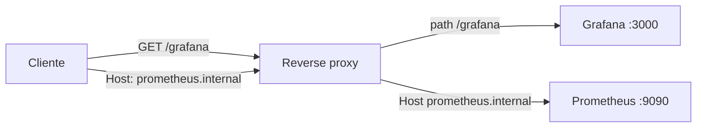

> **Para quem é:** quem precisa entender como um reverse proxy decide para qual serviço interno encaminhar uma requisição, antes de configurar um.

Um **reverse proxy** fica na frente de um conjunto de serviços e decide, para cada requisição recebida, qual backend deve atendê-la. A distinção que dá nome à categoria é a posição em relação ao cliente: um forward proxy fica entre o cliente e a internet, agindo em nome do cliente (uma VPN, por exemplo); um reverse proxy fica entre o cliente e os servidores internos, agindo em nome dos servidores. Do ponto de vista de cada backend, todo tráfego parece vir do reverse proxy; do ponto de vista do cliente, a resposta parece vir diretamente do serviço solicitado.



## Como o proxy decide o destino

O reverse proxy precisa de algum critério para associar uma requisição recebida a um backend específico. Os três critérios mais comuns not são mutuamente exclusivos e frequentemente aparecem combinados na mesma instalação.

O **roteamento por path** usa o caminho da URL para escolher o destino: uma requisição para `/grafana` vai para o serviço Grafana, uma requisição para `/prometheus` vai para o serviço Prometheus. Em Nginx, isso é expresso com blocos `location`:

```nginx
location /grafana/ {
    proxy_pass http://grafana-svc:3000/;
}

location /prometheus/ {
    proxy_pass http://prometheus-svc:9090/;
}
```

Esse modelo tem uma limitação prática: a aplicação por trás do proxy precisa saber que está sendo servida a partir de um subcaminho, e não da raiz (`/`). Aplicações que geram links absolutos a partir da raiz (muitos dashboards e SPAs se comportam assim) quebram quando expostas apenas por path, a menos que sejam configuradas explicitamente para reconhecer o prefixo.

O **roteamento por host** usa o cabeçalho `Host` da requisição HTTP (ou, em conexões TLS, o campo SNI do handshake) para decidir o destino. Cada serviço recebe um subdomínio próprio, e o proxy usa esse nome para escolher o backend correspondente:

```nginx
server {
    server_name grafana.internal;
    proxy_pass http://grafana-svc:3000;
}

server {
    server_name prometheus.internal;
    proxy_pass http://prometheus-svc:9090;
}
```

Esse modelo evita o problema de subcaminho do roteamento por path, porque cada aplicação continua respondendo a partir da raiz do seu próprio domínio. O custo é a necessidade de um domínio (ou subdomínio) por serviço, e de um certificado que cubra todos eles.

O caso particular de **roteamento por SNI** em conexões HTTPS merece destaque porque acontece antes da descriptografia: o cliente TLS envia o nome do domínio desejado em texto claro, como parte do ClientHello, antes que qualquer chave de sessão seja negociada. O proxy pode ler esse campo e decidir o backend sem precisar terminar a conexão TLS ele mesmo, o que é a base do encaminhamento de conexões cifradas ponta a ponta por SNI (usado, por exemplo, quando o proxy não deve ter acesso à chave privada do certificado do backend).

## Fluxo de uma requisição

Uma requisição típica atravessa o proxy nas seguintes etapas: o cliente abre uma conexão até o proxy; o proxy lê o cabeçalho `Host` (ou o SNI, em TLS) e consulta suas regras de roteamento para identificar o backend correspondente; o proxy abre uma nova conexão até esse backend e encaminha a requisição; o backend processa e responde; o proxy encaminha a resposta de volta ao cliente. Do ponto de vista do cliente, o resultado é indistinguível de uma conexão direta ao backend, exceto por cabeçalhos que o proxy adicione explicitamente (como `X-Forwarded-For`) para preservar informação que, de outra forma, se perderia na nova conexão.

## Implementações comuns

Nginx e Apache HTTP Server são proxies de propósito geral, configurados por arquivos de texto estático; ambos suportam roteamento por path e por host, com Nginx tendo sintaxe mais direta para esse caso de uso específico e Apache oferecendo um ecossistema maior de módulos. HAProxy prioriza throughput e baixa latência em volumes altos de tráfego, com uma sintaxe própria orientada a balanceamento de carga mais do que a roteamento HTTP simples. Traefik se diferencia dos demais por descobrir rotas automaticamente a partir de labels do Docker ou de recursos do Kubernetes (Ingress, IngressRoute), eliminando a necessidade de editar um arquivo de configuração a cada novo serviço; é a escolha mais comum em clusters Kubernetes justamente por essa integração nativa.

## Certificados para múltiplos domínios internos

Um proxy que roteia por host precisa de um certificado TLS válido para cada domínio que atende. Três abordagens resolvem isso: um certificado wildcard (`*.internal`) cobre qualquer subdomínio sob esse sufixo com um único certificado, ao custo de exigir validação DNS (a maioria das autoridades certificadoras não emite wildcards por validação HTTP); um certificado único com múltiplos SANs (Subject Alternative Names) lista explicitamente cada domínio coberto, mas precisa ser reemitido sempre que um domínio novo é adicionado; e a emissão automatizada via cert-manager, que solicita e renova certificados por domínio conforme os recursos do cluster declaram a necessidade, é a abordagem recomendada quando o proxy já roda dentro do Kubernetes, porque elimina a gestão manual de renovação. A escolha entre essas opções está detalhada em [emissão de certificados com cert-manager](../../guides/tasks/certificates/install-cert-manager/).

## Quando um reverse proxy é a ferramenta certa

Um reverse proxy resolve bem o problema de consolidar múltiplos serviços internos atrás de um único ponto de entrada, de aplicar TLS e autenticação de forma centralizada em vez de replicá-las em cada serviço, e de fazer split-horizon DNS funcionar sem expor uma porta por serviço (veja [split-horizon DNS](./split-horizon-dns/) para o modelo de resolução de nomes que normalmente acompanha essa configuração). Não é a ferramenta certa para tráfego TCP genérico que não fala HTTP ou TLS com SNI, caso em que um balanceador de camada 4 (o próprio HAProxy em modo TCP, por exemplo) é mais apropriado; e adiciona latência mensurável, ainda que pequena, que pode ser relevante em cargas sensíveis a esse detalhe.

## Páginas relacionadas

- [Split-horizon DNS](./split-horizon-dns/)
- [Configurar CoreDNS interno (procedimento)](../../guides/tasks/networking/setup-coredns-internal/)
- [Configurar reverse proxy em localhost (procedimento)](../../guides/tasks/networking/setup-reverse-proxy-localhost/)

## Referências

- [Nginx: `proxy_pass`](https://nginx.org/en/docs/http/ngx_http_proxy_module.html#proxy_pass): documentação oficial do módulo de proxy reverso do Nginx.
- [HAProxy: Configuration Manual](https://www.haproxy.org/): referência oficial de configuração do HAProxy.
- [Traefik: Routing](https://doc.traefik.io/traefik/routing/overview/): documentação oficial de roteamento do Traefik.
