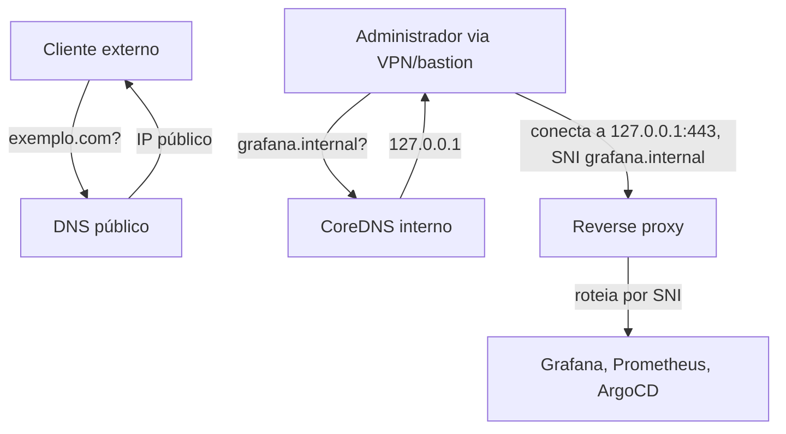

> **Para quem é:** operadores que querem resolver nomes de serviços internos por DNS, sem publicar uma porta por serviço no host.

**Split-horizon DNS** é uma configuração em que o mesmo nome de domínio resolve para endereços diferentes dependendo de quem faz a consulta: um cliente na rede interna recebe um endereço, e um cliente na internet pública recebe outro (ou nenhum, se o domínio não existir na visão externa). O nome vem da ideia de que o "horizonte" de resolução muda conforme a origem da pergunta.

## O problema que resolve

Um cluster que expõe serviços de administração (Grafana, Prometheus, o próprio ArgoCD) enfrenta um dilema: publicar essas interfaces na internet pública é uma superfície de ataque desnecessária, mas acessá-las sem DNS nenhum normalmente significa depender de `kubectl port-forward`, um comando manual, que precisa ser reexecutado a cada nova sessão e que se torna tedioso quando vários serviços diferentes precisam de acesso simultâneo.

O split-horizon DNS remove essa fricção sem expor os serviços publicamente. Um administrador acessando o cluster através de uma VPN ou de um bastion consulta o mesmo nome de domínio (por exemplo, `grafana.internal`) que resolve, nessa visão interna, para um endereço que um reverse proxy interpreta e usa para rotear a conexão até o Pod correto. A internet pública nunca vê esse nome, porque a zona DNS que o resolve só existe dentro da rede interna.

## Por que a resposta interna aponta para localhost

Quando o resolvedor interno responde `127.0.0.1` para um nome como `grafana.internal`, o endereço não se refere ao cluster, e sim à máquina que está fazendo a consulta. Isso só funciona porque o reverse proxy roda no mesmo host que resolve o DNS para o administrador, seja um bastion dedicado, um gateway de VPN, ou o próprio túnel SSH estabelecido pelo administrador até um ponto de entrada do cluster. A conexão até o serviço final acontece em duas etapas que o administrador não precisa gerenciar manualmente: a resolução do nome aponta para o localhost desse ponto de entrada, e o reverse proxy, rodando ali, decide o backend real a partir do nome que o próprio cliente informou na conexão.

Esse é o motivo pelo qual o SNI (Server Name Indication), a extensão TLS que transmite o nome do domínio solicitado antes da negociação da chave de sessão, é o mecanismo mais comum para o roteamento nessa última etapa: ele permite que várias conexões diferentes, endereçadas a serviços diferentes, cheguem todas à mesma porta 443 do proxy, que decide o destino sem precisar terminar a conexão TLS antes de rotear. O mecanismo é o mesmo descrito com mais detalhe em [reverse proxy, fundamentos](./reverse-proxy-basics/#como-o-proxy-decide-o-destino).

## Quando faz sentido usar

Split-horizon DNS se encaixa bem em serviços de administração e observabilidade que só devem ser alcançáveis por quem já tem acesso à rede interna (VPN ou bastion), eliminando a necessidade de `kubectl port-forward` manual a cada sessão sem expor nada publicamente. Não é a ferramenta certa para serviços que já precisam ser públicos, porque esses já resolvem normalmente por DNS público e passam por um caminho de exposição diferente (com WAF ou load balancer, tipicamente); e não simplifica ambientes com múltiplas redes segmentadas que exigem visões de DNS totalmente distintas entre si, caso em que a configuração de múltiplas zonas internas passa a ter complexidade equivalente à de operar DNS público separado por segmento.

## Comparação com o acesso manual

| Aspecto | Sem split-horizon | Com split-horizon |
| --- | --- | --- |
| Acesso a um serviço | `kubectl port-forward svc/grafana 3000:3000` | `curl https://grafana.internal` |
| Repetição necessária | A cada nova sessão de terminal | Nenhuma, a resolução é persistente |
| Porta usada | Aleatória, escolhida a cada `port-forward` | 443, fixa, via SNI |
| Vários serviços simultâneos | Um `port-forward` por serviço, em terminais separados | Uma porta única, roteada por nome |
| Reconexão de VPN/SSH | Port-forward cai e precisa ser reaberto | DNS e proxy continuam disponíveis automaticamente |

## Componentes envolvidos

Uma configuração completa de split-horizon DNS para um cluster depende de quatro peças trabalhando em conjunto: um servidor DNS interno (tipicamente CoreDNS, rodando dentro do cluster ou em um host dedicado) que responde apenas para consultas originadas na rede confiável; um reverse proxy que roteia por SNI ou por host, recebendo todas as conexões na mesma porta e decidindo o backend a partir do nome informado; certificados TLS válidos para cada domínio interno, emitidos por wildcard, por SANs múltiplos, ou automaticamente via cert-manager (as opções estão detalhadas em [reverse proxy, fundamentos](./reverse-proxy-basics/#certificados-para-múltiplos-domínios-internos)); e uma rota de acesso à rede interna, seja um túnel SSH, uma VPN, ou acesso direto a partir de uma máquina já posicionada dentro do perímetro.

## Páginas relacionadas

- [Reverse proxy, fundamentos](./reverse-proxy-basics/)
- [Resolução DNS: do stub resolver à resposta autoritativa](./dns/resolution/): o mecanismo geral por trás do resolvedor recursivo interno usado aqui.
- [Configurar CoreDNS interno (procedimento)](../../../guides/tasks/networking/setup-coredns-internal/)
- [Configurar reverse proxy em localhost (procedimento)](../../../guides/tasks/networking/setup-reverse-proxy-localhost/)

## Referências

- [DNS Server Types (Cloudflare Learning Center)](https://www.cloudflare.com/en-gb/learning/dns/dns-server-types/): explica a diferença entre servidores DNS autoritativos e recursivos.
- [Server Name Indication (Wikipedia)](https://en.wikipedia.org/wiki/Server_Name_Indication): descreve o funcionamento da extensão SNI do TLS.
- [Server Names (Nginx)](https://nginx.org/en/docs/http/server_names.html): documentação oficial do roteamento por host no Nginx.
