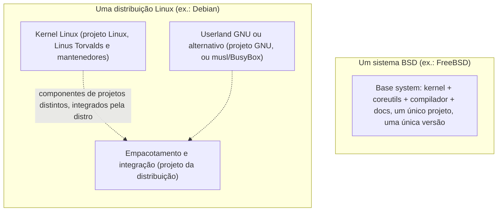

> **Para quem é:** quem já usa Linux no dia a dia e ouve "BSD" como uma categoria vaga, sem saber que é uma família de projetos distintos com filosofias diferentes entre si, nem por que "base system" muda a forma como o sistema inteiro é versionado e mantido.

"Linux" é só o kernel; a distribuição em volta (userland, gerenciador de pacotes, sistema de inicialização) vem de um projeto completamente separado, e é comum um usuário de Linux nunca ter parado para notar essa costura porque ela é tão familiar. Um sistema **BSD** inverte essa relação por design: kernel e userland são desenvolvidos, versionados e lançados juntos, pelo mesmo projeto, como uma unidade coesa chamada **base system**. Essa diferença estrutural, mais do que qualquer feature específica, é o que separa conceitualmente "um BSD" de "uma distribuição Linux", e o ponto de partida necessário antes de falar dos projetos individuais.

## Base system integrado vs. kernel e userland de origens distintas

Num sistema BSD, o kernel, o compilador, os utilitários coreutils-equivalentes, e boa parte da documentação são desenvolvidos dentro do mesmo repositório de código-fonte e lançados sob o mesmo número de versão, como já ficou implícito ao citar "FreeBSD 4.0" na página anterior desta trilha sobre isolamento (Jails entraram no FreeBSD **como parte** do lançamento 4.0, não como um pacote instalado depois). Isso significa que atualizar um sistema BSD para uma nova versão principal atualiza kernel e userland em lockstep, testados juntos pelo mesmo projeto, uma garantia de coesão que uma distribuição Linux não tem da mesma forma, porque o kernel Linux e o userland GNU (ou musl/BusyBox, já discutidos na página de coreutils desta trilha) são versionados por projetos completamente separados, e a distribuição é quem assume a responsabilidade de integrar as duas peças de forma coerente.

## FreeBSD: o BSD generalista, focado em servidor e desempenho

**FreeBSD** é o BSD com a base de usuários mais ampla e o foco mais generalista da família: desempenho de rede e I/O, um sistema de portas/pacotes maduro (a próxima seção desta página), e um histórico de adoção em infraestrutura de produção de grande escala (Netflix usa FreeBSD como base do seu appliance de distribuição de conteúdo (Open Connect), citando desempenho de rede como motivo declarado). O Jail, já coberto em [Solaris Zones e BSD Jails](../../virtualization/zones-and-jails/), nasceu no FreeBSD e continua sendo um dos mecanismos de isolamento mais usados na família.

## OpenBSD: segurança como prioridade de design, não recurso adicional

**OpenBSD** trata segurança e correção de código como o critério central de qualquer decisão de design, não como uma camada adicionada depois: o projeto mantém uma prática contínua de auditoria de código-fonte, e prioriza simplicidade e clareza de implementação sobre performance ou conjunto de features, mesmo quando isso significa recusar uma otimização que tornaria o código mais difícil de auditar. Esse foco produziu dois projetos hoje usados muito além do próprio OpenBSD: **OpenSSH**, o cliente/servidor SSH de fato universal em sistemas Unix-like (incluindo a maioria das distribuições Linux), e **PF** (Packet Filter), o firewall stateful do OpenBSD, também adotado por outros BSDs. "Secure by default" não é um slogan de marketing do projeto, é uma política de engenharia declarada: uma instalação padrão do OpenBSD já vem com uma superfície de ataque minimizada, serviços desnecessários desligados, sem que o operador precise endurecer o sistema manualmente depois.

## NetBSD: portabilidade acima de tudo

**NetBSD** prioriza rodar em tantas arquiteturas de hardware quanto possível, da plataforma de servidor comum a hardware embarcado e a máquinas obsoletas que nenhum outro sistema operacional moderno ainda suporta; "of course it runs NetBSD" é uma piada recorrente da própria comunidade sobre essa amplitude de suporte, citada com frequência quando alguém consegue rodar o sistema num dispositivo inusitado. Essa prioridade molda decisões de arquitetura interna do projeto (uma camada de abstração de hardware desenhada desde o início para portar o sistema a uma arquitetura nova com esforço relativamente contido), o motivo pelo qual NetBSD é uma escolha comum em contextos de pesquisa e em hardware fora do padrão x86_64/ARM comum.

## DragonFly BSD: o fork que escolheu um caminho técnico próprio

**DragonFly BSD** nasceu em 2003 como um fork do FreeBSD 4.x, criado por Matthew Dillon após uma divergência técnica sobre a direção da arquitetura de multiprocessamento simétrico (SMP) que o FreeBSD estava adotando na época; em vez de seguir o caminho do FreeBSD 5.x, Dillon optou por uma abordagem própria. O projeto é hoje mais conhecido por dois desenvolvimentos técnicos originais: o **HAMMER** (e seu sucessor HAMMER2), um sistema de arquivos com suporte nativo a snapshots e projetado para armazenamento multi-terabyte, e uma arquitetura de kernel própria para lidar com concorrência em sistemas multiprocessados, diferente da que o FreeBSD adotou depois da divergência que motivou o fork.

**GhostBSD**, citado aqui em uma frase por completude, é um derivado do FreeBSD focado em oferecer uma experiência de desktop pronta para uso (instalador gráfico, ambiente de desktop pré-configurado), não um BSD independente com base system própria.

## Licenças BSD vs. GPL: consequências práticas, não só filosóficas

A licença BSD (nas suas variantes, como a licença de 2 ou 3 cláusulas) é permissiva: permite que qualquer pessoa ou empresa pegue o código, modifique, e distribua uma versão derivada, incluindo uma versão proprietária de código fechado, sem obrigação de publicar as modificações. A GPL (GNU General Public License), sob a qual a maior parte do userland GNU e o próprio kernel Linux são licenciados, é copyleft: qualquer trabalho derivado distribuído precisa ser disponibilizado sob a mesma licença, com o código-fonte correspondente acessível.

Essa diferença tem consequências reais e visíveis fora do próprio mundo BSD: o núcleo Darwin do macOS é derivado de código BSD (FreeBSD forneceu boa parte do userland original do NeXTSTEP/Darwin), e a Apple pôde construir um sistema operacional proprietário por cima sem violar a licença, porque a licença BSD permite exatamente esse uso. O sistema operacional dos consoles PlayStation da Sony também é derivado de FreeBSD, pelo mesmo motivo. Nenhum dos dois casos seria possível da mesma forma com código sob GPL, que exigiria disponibilizar o código-fonte de qualquer modificação distribuída. Essa é a razão prática, não ideológica, pela qual empresas que querem construir produtos fechados por cima de uma base Unix-like frequentemente preferem partir de código BSD.

## Ports e pkg: como um sistema BSD instala software

O **ports tree** (encontrado, com variações próprias, em FreeBSD, OpenBSD e NetBSD) é uma coleção de Makefiles e metadados que descrevem como baixar o código-fonte de um programa, aplicar patches específicos do sistema, compilar e instalar, um modelo historicamente mais próximo de compilar software a partir do código-fonte do que de baixar um binário pronto. **pkg** (o gerenciador de pacotes binários do FreeBSD, com equivalentes próprios em outros BSDs) resolve o caso comum de instalar software sem precisar compilar localmente, distribuindo pacotes binários pré-compilados a partir da mesma árvore de ports, de forma conceitualmente parecida a `apt`/`dnf` no mundo Linux, mas construída sobre a definição de pacote que o ports tree já descreve. Um operador tipicamente usa `pkg` para o caso comum (instalar algo rápido, sem precisar do tempo de compilação) e recorre ao ports tree diretamente quando precisa de uma opção de compilação não coberta pelo pacote binário padrão, ou de uma versão diferente da empacotada.

## Páginas relacionadas

- [Solaris Zones e BSD Jails](../../virtualization/zones-and-jails/): o mecanismo de isolamento que nasceu no FreeBSD, com histórico e comparação com namespaces do Linux.
- [Coreutils e alternativas: GNU, BusyBox e uutils](../coreutils-and-alternatives/): as diferenças de flags entre os coreutils GNU (Linux) e os equivalentes BSD já citados nesta trilha.

## Referências

- [FreeBSD Handbook](https://docs.freebsd.org/en/books/handbook/): documentação oficial, incluindo ports/pkg e a filosofia de base system.
- [OpenBSD Project (site oficial)](https://www.openbsd.org/): política de segurança declarada, e a origem de OpenSSH e PF.
- [NetBSD Project (site oficial)](https://www.netbsd.org/): plataformas de hardware suportadas.
- [DragonFly BSD (site oficial)](https://www.dragonflybsd.org/): histórico do fork e documentação do HAMMER2.
- [GhostBSD (site oficial)](https://www.ghostbsd.org/): derivado do FreeBSD focado em desktop.
