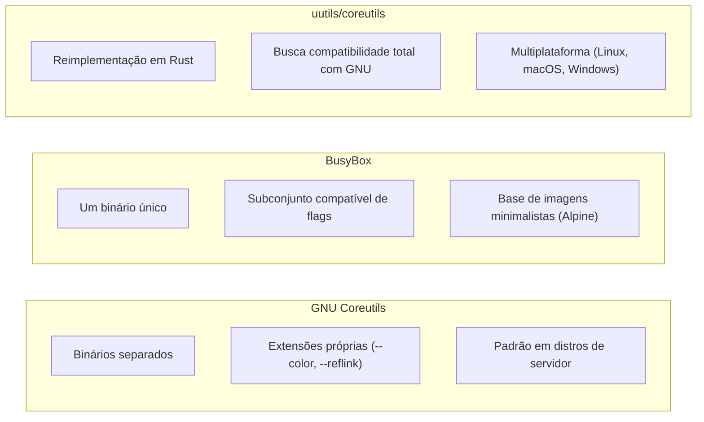

> **Para quem é:** quem já sabe que `ls`, `cp` e `cat` existem, mas nunca parou para notar que "qual binário responde por esse nome" muda dependendo se o sistema é um servidor Debian comum ou uma imagem de container baseada em Alpine.

Comandos como `ls`, `cp`, `mv`, `cat`, `rm`, `mkdir` parecem parte do próprio shell, mas não são: cada um é um binário separado, agrupado sob o nome **coreutils**, e qual implementação real responde por esses nomes varia mais do que a maioria dos scripts assume. A página anterior desta trilha já cobriu como `sed`, `awk` e `ps` divergem entre GNU e BSD; esta página foca no conjunto ainda mais básico de utilitários, e em duas alternativas reais ao GNU Coreutils que aparecem com frequência crescente em ambientes de container e em discussões de reescrita em Rust.

## GNU Coreutils: o padrão de fato em distribuições Linux de servidor

**GNU Coreutils** é o pacote que fornece a implementação de `ls`, `cp`, `mv`, `rm`, `cat`, `mkdir`, `chmod`, `chown`, e dezenas de outros utilitários básicos na maioria das distribuições Linux voltadas a servidor, incluindo o Debian que este notebook usa como base. Cada um desses comandos tem uma base definida pelo padrão POSIX (o conjunto mínimo de flags e comportamento que qualquer sistema compatível precisa oferecer), mas o GNU Coreutils vai além, com extensões próprias que se tornaram tão comuns que muitos scripts as usam sem perceber que não são universais: `ls --color=auto` (saída colorida), `cp --reflink=auto` (cópia copy-on-write quando o filesystem suporta), `date -d "yesterday"` (aritmética de data em linguagem natural), `stat --format` (formatação customizada de saída) são todas extensões GNU, ausentes ou com sintaxe diferente em implementações BSD dos mesmos comandos.

## BusyBox: um binário só, dezenas de comandos

**BusyBox** resolve um problema diferente do GNU Coreutils: em vez de dezenas de binários separados, cada um relativamente pequeno mas ainda assim somando megabytes de espaço em disco, BusyBox compila um único executável que implementa versões simplificadas de centenas de comandos Unix comuns (não só coreutils, também utilitários de rede, `init`, um shell `ash` compatível com POSIX), e usa links simbólicos com o nome de cada comando apontando para esse binário único, que detecta por qual nome foi chamado e se comporta de acordo. O resultado é uma pegada de disco drasticamente menor, o motivo pelo qual BusyBox é a base de imagens de container minimalistas: Alpine Linux, uma das distribuições de imagem base mais usadas em Dockerfiles justamente pelo tamanho reduzido, usa BusyBox para boa parte de seu userland, com `musl libc` no lugar da `glibc` tradicional.

Essa escolha tem um custo direto que já apareceu implicitamente na discussão de shells desta trilha: o `ash` do BusyBox é um shell compatível com POSIX sh, sem as extensões do Bash, então uma imagem Alpine sem Bash instalado explicitamente quebra qualquer script que dependa de bashisms, mesmo que o `Dockerfile` declare `#!/bin/bash` como shebang, porque o binário `bash` simplesmente não existe nessa imagem por padrão. Da mesma forma, os comandos coreutils do BusyBox implementam um subconjunto das flags do GNU Coreutils equivalente, o suficiente para a maioria dos usos comuns, mas não a superfície completa; um script que usa uma flag GNU específica (como as extensões citadas na seção anterior) pode falhar silenciosamente ou com erro de flag desconhecida ao rodar sobre BusyBox.

## uutils/coreutils: a reimplementação em Rust

O projeto **uutils/coreutils** reimplementa o conjunto completo do GNU Coreutils em Rust, com o objetivo declarado de ser um substituto multiplataforma (Linux, macOS, Windows, outros Unix), compatível linha de comando por linha de comando com o GNU Coreutils original, aproveitando as garantias de segurança de memória da linguagem. Até a escrita, o projeto já implementa a maior parte dos utilitários do GNU Coreutils com compatibilidade considerada madura para uso geral, e passou a ser adotado experimentalmente em algumas distribuições como alternativa avaliável ao pacote GNU tradicional; confira o [repositório oficial do uutils/coreutils](https://github.com/uutils/coreutils) para o estado atual de compatibilidade e adoção antes de depender dele em produção, porque o projeto evolui rápido e a cobertura de flags específicas ainda pode variar por utilitário.

## Diferenças práticas de flags que quebram scripts

Além de `sed -i`, `awk` e `ps`, já cobertos na página anterior, alguns coreutils comuns também divergem de forma que quebra scripts supostamente portáveis:

| Comando/flag | GNU (Linux) | BSD (incluindo macOS) |
| --- | --- | --- |
| `date -d "1 day ago"` | Suportado (aritmética de data em linguagem natural) | Não existe; BSD `date` usa `-v-1d` para o mesmo efeito |
| `readlink -f arquivo` | Resolve o caminho absoluto, seguindo links simbólicos recursivamente | Não suportado em todas as variantes BSD; `realpath` (se disponível) é mais portável |
| `cp -r` vs. `cp -R` | Ambas aceitas como equivalentes | Historicamente só `-R` era garantida em alguns BSD; `-r` pode não existir em implementações mais antigas |
| `stat --format='%s'` | Sintaxe `--format` (ou `-c`) | BSD `stat` usa `-f` com um formato de string diferente (`%z` para tamanho, por exemplo) |

O padrão que se repete em todas as linhas desta tabela, e na tabela de `sed`/`awk`/`ps` da página anterior, é o mesmo: uma flag GNU que parece universal porque "sempre funcionou" na máquina de quem escreveu o script, e que só se revela não portável quando o script roda pela primeira vez fora de um ambiente Linux com GNU Coreutils. Testar um script dentro de uma imagem Alpine (BusyBox) é uma forma rápida e prática de descobrir esse tipo de dependência oculta antes de descobrir em produção, mesmo quando o alvo final de execução não é, de fato, um sistema BSD.

## Páginas relacionadas

- [Portabilidade de scripts shell](../shell-scripting-portability/): as diferenças GNU vs. BSD em `sed`, `awk` e `ps`, o par natural desta página.
- [Shells: interativo, login e o que POSIX garante](../shells/): por que uma imagem Alpine sem Bash quebra um script com shebang `#!/bin/bash`.

## Referências

- [GNU Coreutils (documentação oficial)](https://www.gnu.org/software/coreutils/manual/coreutils.html): referência completa de cada utilitário e suas extensões.
- [BusyBox (documentação oficial)](https://busybox.net/): lista de comandos implementados e o modelo de binário único.
- [uutils/coreutils (repositório oficial)](https://github.com/uutils/coreutils): estado de compatibilidade com o GNU Coreutils (até a escrita; confira o repositório para o estado atual).
- [Alpine Linux (documentação oficial)](https://www.alpinelinux.org/about/): musl libc e BusyBox como base do userland minimalista.
