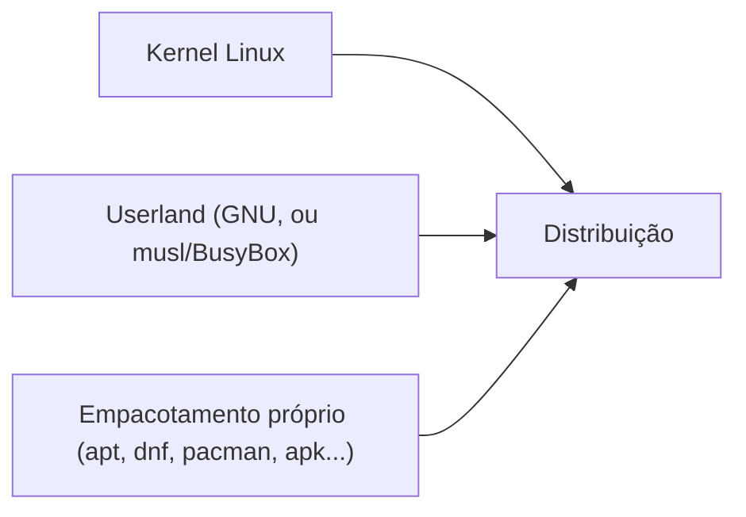

> **Para quem é:** quem já opera um servidor Debian todo dia (a base deste notebook) e quer entender o que realmente diferencia uma distribuição de outra, além do gerenciador de pacotes.

A página anterior desta trilha definiu um sistema BSD pelo que ele **não** separa: kernel e userland versionados juntos, como uma unidade. Uma **distribuição Linux** é exatamente o oposto: o kernel Linux é um projeto, o userland (GNU, na maioria dos casos, ou musl/BusyBox, já cobertos na página de coreutils desta trilha) é outro, e uma distro é o trabalho de integrar essas peças de origens distintas, junto com um sistema de empacotamento próprio, numa combinação coerente o suficiente para ser instalada e usada como um sistema único.

## A equação de uma distro

Nenhuma dessas três peças, sozinha, é "Linux" no sentido popular do termo: o kernel sem userland não tem nem um shell para o usuário interagir; o userland GNU sem um kernel (o próprio projeto GNU tentou, historicamente, construir seu próprio kernel, Hurd, sem nunca atingir adoção ampla) não tem onde rodar; e o empacotamento é a peça que decide como o sistema recebe atualizações, resolve dependências entre pacotes, e se mantém consistente ao longo do tempo. É essa terceira peça, mais do que a escolha de kernel ou userland (praticamente idênticos entre a maioria das distros mainstream), que mais diferencia uma família de distribuições de outra na prática do dia a dia de quem opera o sistema.

## As famílias principais, e o que cada uma prioriza

**Debian/Ubuntu** priorizam estabilidade e um ciclo de lançamento previsível sobre pacotes com a versão mais recente possível: o Debian estável, em particular, é conhecido por manter versões de pacotes congeladas (com backport de correções de segurança, não de features novas) durante todo o ciclo de suporte, uma escolha deliberada que prioriza previsibilidade em produção sobre acesso imediato à última versão de qualquer software. Ubuntu é construído sobre a base do Debian, com um ciclo de lançamento próprio e suporte comercial da Canonical, oferecendo uma opção mais próxima do Debian nas convenções, mas com um calendário de lançamento e política de suporte diferentes. `apt` é o gerenciador de pacotes de ambos, operando sobre pacotes `.deb`.

**Fedora/RHEL** seguem uma relação parecida à do Ubuntu/Debian, mas com prioridades diferentes: Fedora é o ponto de desenvolvimento mais próximo do estado da arte, com ciclos de lançamento mais curtos e adoção mais rápida de versões novas de kernel e software; RHEL (Red Hat Enterprise Linux) é a distribuição comercial construída a partir do trabalho consolidado no Fedora, com suporte de longo prazo, certificações, e um modelo de negócio voltado a contratos empresariais. `dnf` (sucessor do `yum`) é o gerenciador de pacotes de ambos, operando sobre pacotes `.rpm`.

**Arch Linux** prioriza um modelo rolling release (atualizações contínuas, sem versões numeradas discretas como Debian ou Fedora) e minimalismo deliberado: uma instalação Arch começa praticamente vazia, e o usuário instala e configura exatamente o que precisa, em vez de partir de um conjunto de pacotes pré-selecionados pela distro. Essa filosofia de "sem opinião imposta" atrai um público que quer controle granular sobre cada componente do sistema, ao custo de exigir mais conhecimento prévio do operador do que uma instalação Debian/Ubuntu guiada. `pacman` é o gerenciador de pacotes, com a AUR (Arch User Repository) como um repositório adicional mantido pela comunidade, fora do repositório oficial.

**Alpine Linux**, já citado na página de coreutils desta trilha como base de imagens de container minimalistas, prioriza tamanho reduzido acima de tudo: musl libc no lugar da glibc tradicional, BusyBox no lugar do GNU Coreutils completo, e `apk` como gerenciador de pacotes, também minimalista. Essa combinação produz uma imagem base ordens de grandeza menor que uma distro Debian/Ubuntu completa, o motivo de sua adoção generalizada em `Dockerfile`s voltados a produção, ao custo já discutido na página de portabilidade desta trilha: scripts que assumem Bash ou flags GNU específicas podem quebrar sobre Alpine sem aviso claro.

## Por que este notebook usa Debian, sem universalizar essa escolha

O escopo declarado deste projeto lista hosts Debian ou Ubuntu com `systemd` como base suportada (ver [Escopo do projeto](../../../project/scope/)), uma decisão que prioriza os mesmos critérios que tornam Debian atrativo para infraestrutura de servidor em geral: estabilidade de longo prazo sobre a versão mais recente de qualquer pacote individual, um ciclo de suporte previsível o suficiente para planejar upgrades de um cluster com antecedência, e a base compartilhada com Ubuntu, que amplia a compatibilidade prática dos procedimentos deste notebook para quem já roda Ubuntu em produção sem exigir adaptação significativa. Essa não é uma afirmação de que Debian é objetivamente superior para todo caso de uso: Fedora/RHEL faz mais sentido para quem já opera dentro do ecossistema Red Hat ou depende de suporte comercial contratual; Arch Linux atrai operadores que priorizam controle granular sobre estabilidade congelada; Alpine é a escolha certa dentro de um container, não como sistema operacional de host completo. A escolha de Debian aqui é uma decisão de escopo deste projeto específico, documentada para que o leitor entenda o motivo, não uma recomendação universal de que toda infraestrutura deveria seguir o mesmo caminho.

## Páginas relacionadas

- [Coreutils e alternativas: GNU, BusyBox e uutils](../coreutils-and-alternatives/): Alpine, musl e BusyBox já cobertos em detalhe técnico.
- [A família BSD: FreeBSD, OpenBSD, NetBSD e DragonFly BSD](../bsd-family/): o modelo oposto de composição (base system integrado, em vez de kernel e userland de projetos distintos).
- [Escopo do projeto](../../../project/scope/): a decisão de escopo deste notebook por Debian/Ubuntu como base de host suportada.

## Referências

- [Debian: sobre o projeto (documentação oficial)](https://www.debian.org/intro/about): filosofia do projeto e política de lançamento estável.
- [Fedora Project (site oficial)](https://fedoraproject.org/): relação entre Fedora e RHEL.
- [Arch Linux Wiki: Arch Linux (documentação oficial)](https://wiki.archlinux.org/title/Arch_Linux): filosofia rolling release e minimalismo.
- [Alpine Linux (documentação oficial)](https://www.alpinelinux.org/about/): musl libc, BusyBox e `apk`, já citados na página de coreutils desta trilha.
