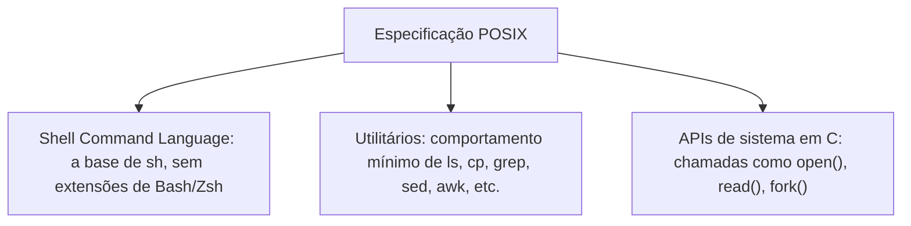

> **Para quem é:** quem já viu o termo POSIX aparecer nas três páginas anteriores desta trilha (como base de `sh`, como a linha que separa bashisms de sintaxe portável, como o motivo de `command -v` ser mais confiável que `which`) e quer entender o que esse padrão realmente é, de uma vez.

As três páginas anteriores desta trilha citam POSIX repetidamente sem nunca parar para definir o que o termo cobre de fato. Essa página fecha essa lacuna: POSIX não é um produto, uma distribuição, ou um shell específico, é uma especificação escrita, mantida pelo Open Group, que define um conjunto mínimo de comportamento que qualquer sistema "compatível" precisa implementar, para que software escrito contra essa especificação rode sem modificação em qualquer sistema que a implemente.

## O que o POSIX realmente padroniza

A especificação POSIX (formalmente ISO/IEC/IEEE 9945, publicada pelo Open Group como parte do Single UNIX Specification) cobre três áreas centrais que já apareceram nesta trilha sem serem nomeadas como tal:

O **Shell Command Language** é exatamente a base descrita na primeira página desta trilha: a sintaxe que `#!/bin/sh` garante, sem `[[ ]]`, arrays, ou qualquer outra extensão de Bash/Zsh. Os **utilitários** cobrem o comportamento mínimo esperado de comandos como `grep`, `sed`, `awk`, `ls`, `cp`, já discutidos nas duas páginas anteriores como o denominador comum entre GNU Coreutils e as implementações BSD: POSIX não escolhe um lado dessa divergência, define o subconjunto de flags e comportamento que os dois lados são obrigados a implementar igual, e deixa extensões (como `--color` do GNU ou `-v` do `date` do BSD) como decisão própria de cada implementação, fora do escopo do padrão. As **APIs de sistema em C** (`open()`, `read()`, `write()`, `fork()`, `exec()`, entre centenas de outras) são a parte da especificação menos visível para quem só escreve scripts shell, mas é a base que permite que um programa em C escrito contra POSIX compile e rode em qualquer sistema compatível sem alterar a lógica de acesso ao sistema operacional.

## O que fica explicitamente fora do escopo

POSIX não padroniza gerenciamento de pacotes (`apt`, `dnf`, `pkg`, cada um decisão própria da distribuição ou do sistema BSD), não padroniza um formato de inicialização de sistema (`systemd`, `init` clássico, `runit`, todos fora do escopo), não padroniza interface gráfica, e não padroniza container/virtualização, todos assuntos tratados em outras partes deste notebook sem relação direta com POSIX. Também não padroniza qual shell interativo o usuário usa no dia a dia (Fish, discutido na primeira página desta trilha, é livre para ignorar POSIX completamente porque o padrão nunca prometeu cobrir experiência interativa, só a linguagem de scripting de `sh`). Essa distinção entre "o que POSIX cobre" e "o que cada sistema decide por conta própria" é o motivo pelo qual dois sistemas POSIX-compliant, como um Debian e um FreeBSD, ainda podem divergir enormemente em como se instala software ou como o sistema inicia, mesmo compartilhando o mesmo comportamento de shell e utilitários básicos.

## Como interpretar "POSIX-compliant" numa ferramenta real

A frase "POSIX-compliant" ou "compatível com POSIX", encontrada na documentação de ferramentas reais, quase nunca significa certificação formal (a certificação oficial de conformidade POSIX existe, mas é rara e cara, usada principalmente por fornecedores de sistemas operacionais comerciais como fontes de garantia contratual). Na prática, quando um projeto de software diz que sua ferramenta é "compatível com POSIX", a afirmação normalmente significa uma de duas coisas, e vale a pena checar qual: ou a ferramenta implementa fielmente o subconjunto de comportamento que POSIX exige (o caso do Dash, projetado deliberadamente para ser um `/bin/sh` estrito), ou a ferramenta é um superconjunto que aceita entrada POSIX válida além de suas próprias extensões (o caso do Bash e do Zsh, que rodam a maioria dos scripts POSIX sem modificação, mas também aceitam sintaxe que POSIX não exige). A diferença importa na prática: um script escrito contra a segunda categoria de ferramenta pode, sem querer, usar uma extensão não POSIX e ainda assim rodar sem erro nessa ferramenta específica, criando uma falsa sensação de portabilidade que só quebra quando o mesmo script roda contra uma implementação da primeira categoria.

## A relação com portabilidade entre Linux e BSD

POSIX é, na prática, o contrato que torna um script portável entre Linux e BSD possível em primeiro lugar: sem uma especificação comum, não haveria garantia nenhuma de que `grep`, `sed` ou o próprio shell se comportariam de forma parecida o suficiente entre os dois mundos. Mas, como as duas páginas anteriores desta trilha já deixaram claro através de exemplos concretos (`sed -i` exigindo argumento de sufixo no BSD, `date -d` não existindo fora do GNU, `ps aux` vs. `ps -ef`), POSIX garante o denominador comum, não a experiência completa de nenhum dos dois lados: tanto Linux (via GNU) quanto os BSDs adicionam extensões próprias por cima da base POSIX, e é justamente nessas extensões, fora do que o padrão exige, que scripts supostamente portáveis mais frequentemente quebram. Escrever um script verdadeiramente portável entre Linux e BSD significa, na prática, restringir deliberadamente o uso a exatamente o que POSIX garante, verificável com `shellcheck` (já coberto na página de portabilidade) configurado para sinalizar exatamente esse tipo de extensão não portável.

## Páginas relacionadas

- [Shells: interativo, login e o que POSIX garante](../shells/): a base de POSIX sh, e como Bash/Zsh/Fish se posicionam como superconjuntos ou rupturas dessa base.
- [Portabilidade de scripts shell](../shell-scripting-portability/): bashisms comuns que violam a base POSIX, e shellcheck como forma de verificar isso.
- [Coreutils e alternativas: GNU, BusyBox e uutils](../coreutils-and-alternatives/): o denominador comum de utilitários que POSIX define, e onde GNU e BSD divergem além dele.

## Referências

- [POSIX.1-2024 (Open Group Base Specifications)](https://pubs.opengroup.org/onlinepubs/9799919799/): o texto oficial da especificação atual, incluindo Shell Command Language, utilitários e APIs de sistema.
- [Single UNIX Specification (Open Group)](https://www.opengroup.org/austin/): visão geral do processo de padronização e da certificação formal de conformidade.
