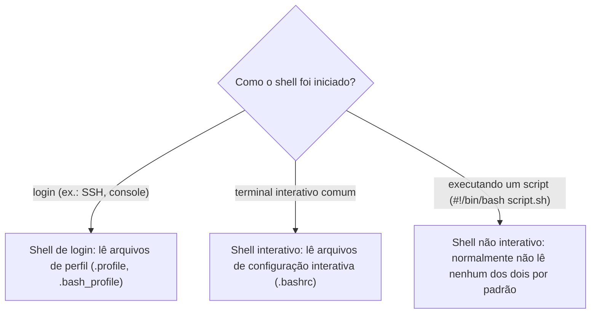

> **Para quem é:** quem já digita comandos num terminal todo dia mas nunca separou "o programa que interpreta o que eu digito" de "a linguagem que um script usa para rodar sem mim".

Um **shell** é, ao mesmo tempo, duas coisas que a maioria dos usuários trata como uma só: um interpretador de linha de comando, que lê o que um humano digita e executa, e uma linguagem de programação completa, usada para escrever scripts que rodam sem ninguém digitando nada. Bash, Zsh e Fish são todos shells nesse sentido duplo; a confusão comum, e o motivo real desta página existir, é assumir que um shell bom para o primeiro uso (interativo) é automaticamente uma boa escolha para o segundo (scripting), quando as duas necessidades puxam para direções diferentes.

## Três modos de um shell, não um

Um mesmo binário de shell se comporta de forma diferente dependendo de como foi invocado, e essa diferença decide quais arquivos de configuração ele lê antes de executar qualquer coisa.

Um **shell de login** é o que inicia uma sessão nova, tipicamente ao conectar via SSH ou abrir um console; ele lê arquivos de perfil (`/etc/profile`, `~/.profile`, ou variantes específicas do shell como `~/.bash_profile`) desenhados para configurar o ambiente uma vez por sessão (variáveis de ambiente, `PATH`). Um **shell interativo** é qualquer shell que espera entrada de um humano e mostra um prompt, seja ele também um shell de login ou não; ele lê arquivos de configuração voltados a conforto de uso (aliases, cores, autocomplete), como `~/.bashrc`. Um **shell não interativo** é o que executa um script sem esperar entrada nenhuma; por padrão, ele não lê nem o arquivo de perfil nem o de configuração interativa, exatamente para evitar que a saída de um alias ou de uma mensagem de boas-vindas interativa contamine a saída de um script que outro programa está processando.

Essa distinção explica um sintoma comum e confuso: uma variável de ambiente ou um alias que funciona perfeitamente quando digitado no terminal, mas desaparece quando o mesmo comando roda dentro de um script ou de um cron job. O terminal interativo carregou um arquivo de configuração que o script, rodando como shell não interativo, nunca leu.

## POSIX sh: o denominador comum

O **POSIX** (Portable Operating System Interface, padronizado pelo Open Group) define, entre outras coisas, uma especificação de shell e um conjunto de utilitários que qualquer sistema "compatível com POSIX" precisa implementar. `sh`, nesse contexto, não é necessariamente um shell independente; na maioria dos sistemas Linux modernos, `/bin/sh` é um link simbólico para outro shell rodando em modo de compatibilidade POSIX (Dash no Debian/Ubuntu, por exemplo), que desliga deliberadamente as extensões não padronizadas desse shell. Um script que roda em `sh` roda, por definição, em qualquer sistema que implemente o padrão POSIX, incluindo sistemas BSD, o que faz de `#!/bin/sh` a escolha certa sempre que portabilidade máxima importa mais do que conveniência de sintaxe.

## Bash, Zsh e Fish: onde cada um se posiciona

**Bash** (Bourne Again Shell) é um superconjunto de POSIX sh: entende tudo que o padrão exige, mais um conjunto grande de extensões próprias (arrays, `[[ ]]` para testes condicionais, expansão de parâmetro avançada, já usadas nas recipes do [cookbook de Bash](../../../toolbox/snippets/bash/)). É o shell padrão de login na maioria das distribuições Linux voltadas a servidor, e por isso a escolha default de portabilidade dentro do próprio universo Linux, mesmo não sendo POSIX puro.

**Zsh** (Z Shell) também é um superconjunto de POSIX sh, com seu próprio conjunto de extensões, em parte sobrepostas com as do Bash e em parte distintas (globbing mais poderoso, um sistema de completions mais sofisticado, temas e frameworks de configuração como Oh My Zsh). É o shell padrão do macOS desde a versão Catalina, e uma escolha comum de shell interativo em ambientes Linux por operadores que preferem seus recursos de produtividade aos do Bash. Como o Bash, um script `#!/bin/zsh` não é portável para um sistema que só tem Bash ou Dash instalados, porque depende de sintaxe própria do Zsh.

**Fish** (Friendly Interactive Shell) rompe deliberadamente com a compatibilidade POSIX: sua sintaxe de scripting é diferente o suficiente que a maioria dos scripts escritos para Bash/Zsh/sh simplesmente não roda em Fish sem reescrita (não existe `if [ ]`, condicionais usam `test` ou `[` de outra forma; variáveis não usam `$()` da mesma forma para todos os casos; não existe operador `&&`/`||` encadeado do jeito POSIX, entre outras diferenças). Essa ruptura é uma escolha deliberada do projeto, priorizando ergonomia interativa (autocomplete e destaque de sintaxe corretos por padrão, sem plugin nenhum, mensagens de erro mais claras) sobre compatibilidade com décadas de scripts POSIX existentes. É por isso que o ambiente de desenvolvimento deste próprio notebook usa Fish como shell interativo do operador, mas todo script do repositório (incluindo o runner `jail-exec.sh`) é escrito com shebang `#!/usr/bin/env bash`, nunca assumindo Fish: a escolha de shell interativo de quem opera o host é inteiramente independente da linguagem em que um script é escrito, e misturar as duas é o erro mais comum que esta distinção previne.

## Interativo, scripting e portabilidade: três eixos independentes

A tabela resume os três shells desta página nos três eixos que o restante desta trilha vai reaproveitar (a próxima página, sobre portabilidade de script, aprofunda o eixo da direita):

| Shell | Bom para uso interativo | Compatível com scripts `sh`/Bash | Portável entre sistemas POSIX |
| --- | --- | --- | --- |
| POSIX sh (ex.: Dash) | Limitado, poucos recursos de conforto | É a própria base | Máxima, por definição |
| Bash | Bom, recursos maduros | Sim (superconjunto de sh) | Alta, mas não é POSIX puro (extensões podem não existir em outro sh) |
| Zsh | Muito bom, altamente configurável | Sim (superconjunto de sh) | Alta para o eixo interativo; scripts com sintaxe própria do Zsh não são portáveis |
| Fish | Muito bom, ergonomia por padrão | Não (sintaxe própria, incompatível) | Nenhuma para scripts; Fish nunca deveria ser o shebang de um script destinado a rodar em outro lugar |

Escolher um shell interativo (Zsh, Fish, ou qualquer outro) é uma decisão pessoal de conforto que não deveria vazar para dentro de um script; escolher a linguagem de um script é uma decisão de portabilidade, guiada por onde esse script vai rodar (só neste host, em qualquer container Linux, em qualquer sistema POSIX incluindo BSD), independente de qual shell interativo a pessoa que o escreveu usa no dia a dia.

## Páginas relacionadas

- [Portabilidade de scripts shell](../shell-scripting-portability/): o eixo de portabilidade aprofundado, com `#!/bin/sh` vs. `#!/bin/bash`, bashisms comuns e shellcheck.
- [Cookbook de Bash](../../../toolbox/snippets/bash/): recipes práticas de scripting em Bash.

## Referências

- [POSIX.1-2024 (Open Group Base Specifications)](https://pubs.opengroup.org/onlinepubs/9799919799/): a especificação formal do Shell Command Language.
- [Bash Reference Manual (GNU)](https://www.gnu.org/software/bash/manual/bash.html): comportamento de shell de login vs. interativo, e as extensões do Bash sobre POSIX sh.
- [Zsh Documentation (oficial)](https://zsh.sourceforge.io/Doc/): manual de referência do Zsh.
- [Fish Documentation (oficial)](https://fishshell.com/docs/current/): documentação oficial, incluindo a justificativa do projeto para não seguir a sintaxe POSIX.
